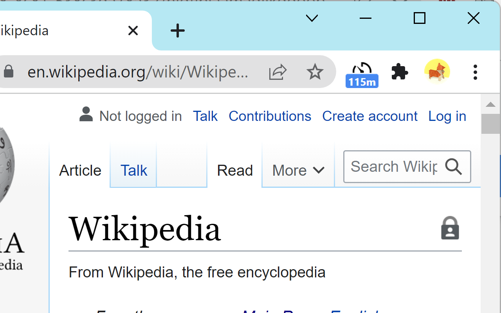
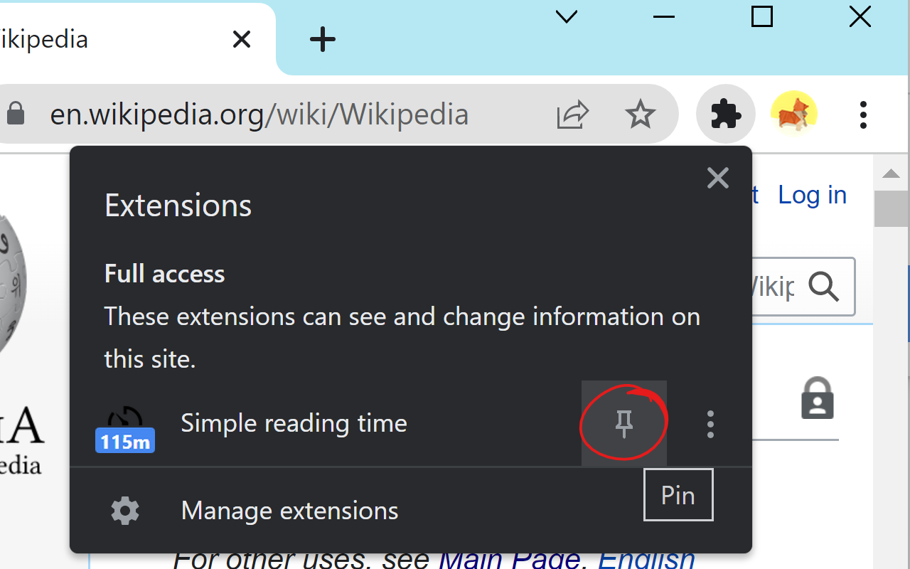

# Description

A simple Chrome extension that displays an estimated time to read the active tab, for example like the one in Medium articles.

With so much content out there, it's often useful to know in advance how long reading a page is going to take you.

The estimate is unintrusive and displayed in the extension action area.

Reading speed can be customized in the options and the label color can be changed to match your browser theme.

# Download

It's still in development and not published on the Chrome Web Store yet. In the meanwhile you can download and load it as an [unpacked extension](https://developer.chrome.com/docs/extensions/mv3/getstarted/#unpacked)

# Usage

Make sure the extension is pinned so you can easily see the counter. It will update when you load a page. If the page content changes dynamically, the counter should also update after a slight delay. In case it doesn't, you can left click the button to force an update.

You can right click and go to Options to configure your reading speed (the default is 200 WPM) and the label color.

# Privacy

Preferences are stored to Chrome sync, everything else is local storage only. The page content is only scanned for whitespace to count the number of words.

# Credits

This was inspired by [Instant Reading Time](https://github.com/umpox/ReadingTime-BrowserExtension), which is no longer supported by the author.